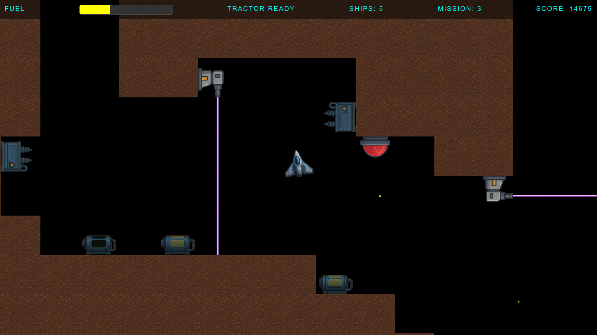
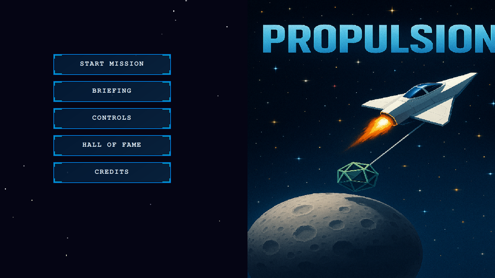
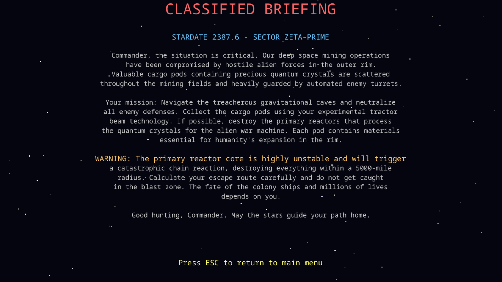
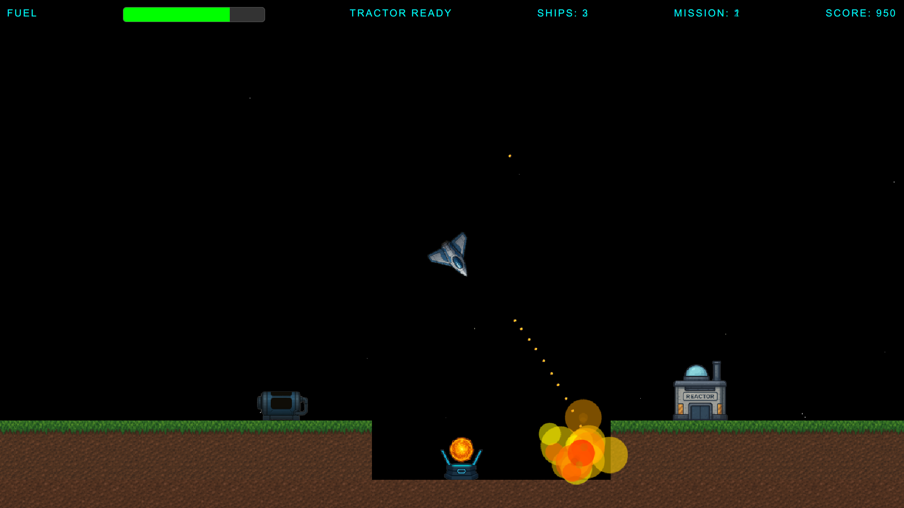
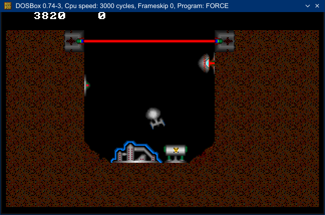
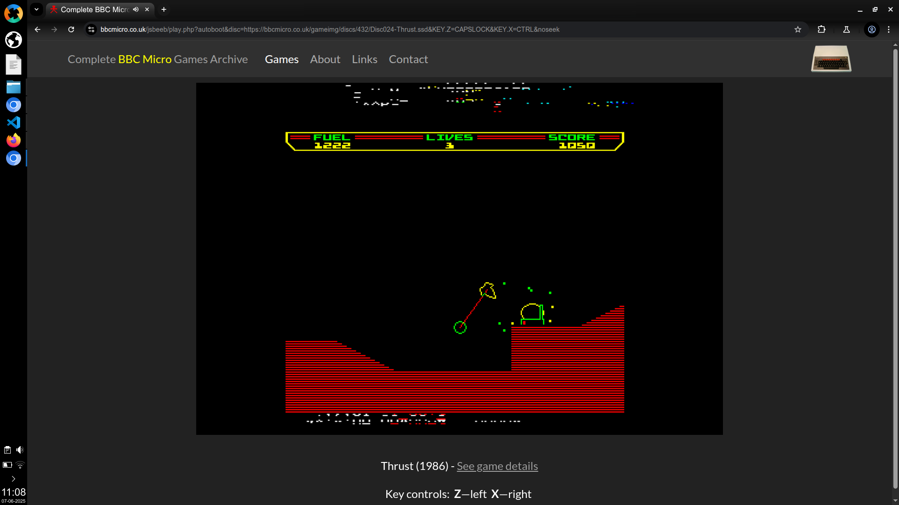

# [Propulsion Web Game

If you wanna play the game: https://vlietland.github.io/propulsion/

This project is a modern web-based remake of the classic space physics game Thrust, originally created in 1986 for the BBC Micro. My original remake was inspired by a high school physics teacher's vector based physics and fun with Thrust on an Acorn Elecron. I challenged myself to do a remake in C++ and assembler on Dos machine in 1997, which I partially completed before loosing interest.

Impression Propulsion - Level 3 - beginning of puzzles:

The original Thrust was a groundbreaking game that introduced realistic physics simulation and momentum-based spacecraft control.

With the advancements in AI development, I decided to spend some time again on the remake and measure productivity gains compared to 1997. The remake took me about four weeks of part-time work. The remake preserves the core gameplay mechanics while bringing the experience to modern web browsers and cross-platform compatibility. I decided to keep the retro-sound, which is a nice walk back to memory lane for some of us.

The game features the same gravity-based gameplay, tractor beam mechanics, and challenging cargo collection missions through underground cave systems. However in contradiction to Thrust, my solution adds dynamic mapediting and tile creation. 

If you read this and would like to add maps and/or tiles. Feel free to do a pull request. The used mapeditor is included the repo. 

## Usage

The game is hosted on GitHub Pages and can be accessed [here](https://vlietland.github.io/propulsion/) It can be played freely in any modern web browser. High score is limited to the used machine, for security sake.

### Game Controls
- **Z and X** - Rotate your ship left/right
- **Shift** - Activate thrust engines  
- **Spacebar** - Engage tractor beam
- **ESC** - Pause game / Return to menu

### Gameplay Objectives
Navigate your ship through gravitational cave systems to:
- Collect valuable cargo pods using your tractor beam
- Avoid crashing into cave walls or enemy defenses
- Manage fuel consumption strategically
- Escape through the cave entrance before time runs out

The physics simulation includes realistic momentum, gravity effects, and tractor beam mechanics that require skill and precision to master.

## Development
This project adheres to modern web development practices, utilizing TypeScript for type safety and a modular architecture. The game engine is built on Excalibur.js, a robust framework for 2D game development. For a detailed summary of all development phases and insights into how AI was utilized during the software development, refer to the [creation process documentation](./propulsionWeb/docs/creationProcess.md).

## Documentation
The overview of the modern Propulsion web application you can read in the [propulsion documentation](./propulsionWeb/docs/propulsion.md).
For details on the architecture of the project, see the [design documentation](./propulsionWeb/docs/design/design.md). 

## History
For more information about the original Thrust game and its historical significance, see the [thrust documentation](./propulsionWeb/docs/thrust.md).

For technical analysis of the 1997 C++ implementation, see the [legacy code documentation](./propulsionWeb/docs/legacyCode.md).

## Screenshots

Propulsion - Menu:

Propulsion - Commanders Briefing:

Propulsion - Level 1 - exploding turret:

The legacy C++ Version (1997):

Original Thrust (1986):

## Project Evolution

| Year | Platform | Technology | Key Features |
|------|----------|------------|--------------|
| 1986 | BBC Micro | 6502 Assembly | Original physics, tractor beam |
| 1997 | DOS/Windows | C++ | Object-oriented design, enhanced graphics |
| 2024 | Web | TypeScript | Cross-platform, modern tooling |

This project demonstrates how classic game concepts can be preserved and enhanced across different technological eras while maintaining their essential gameplay characteristics.

## Contributing

Contributions are welcome! Please read the license terms below and ensure your contributions comply with the GPL v3 requirements.

## License

This project is licensed under the GNU General Public License Version 3. See the [LICENSE](./LICENSE) file for details.

Copyright (C) 2025 Propulsion Game Project