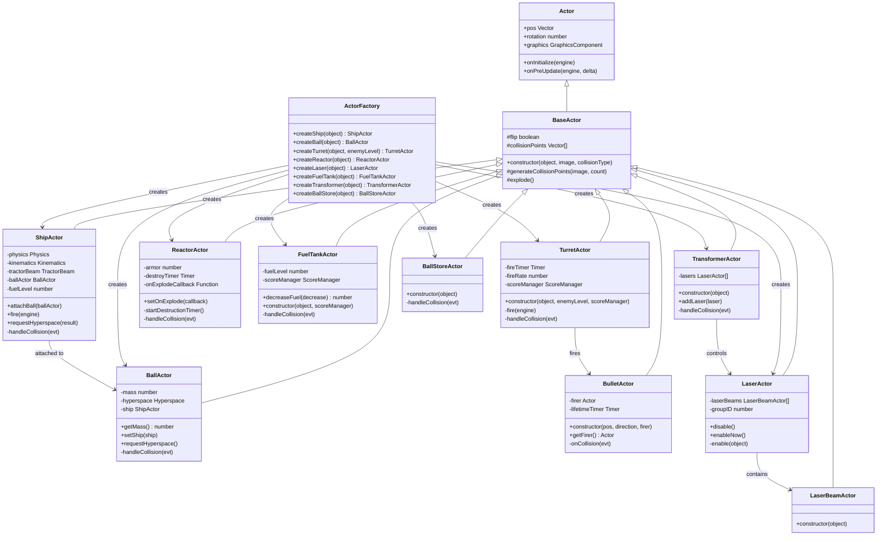
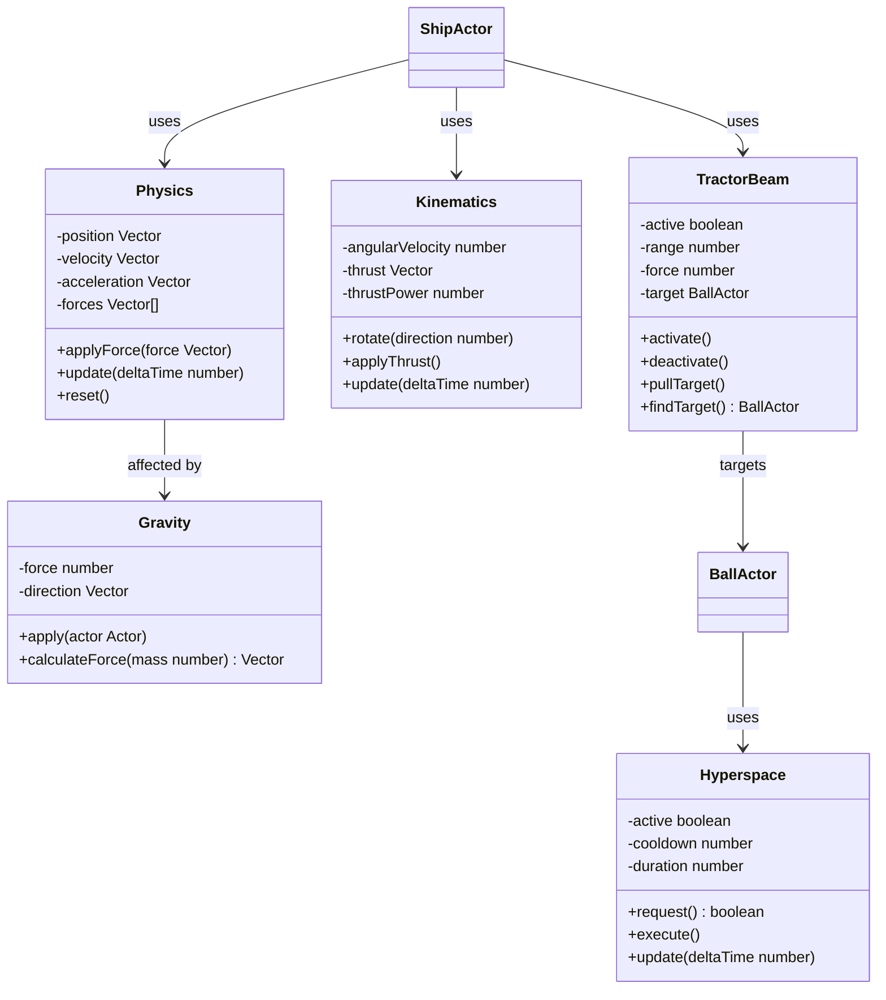
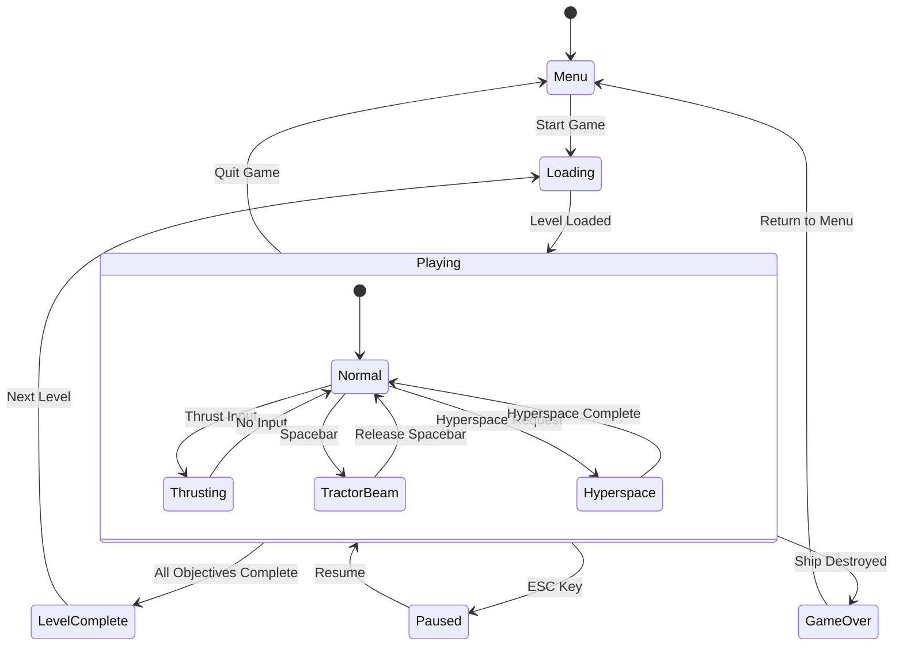
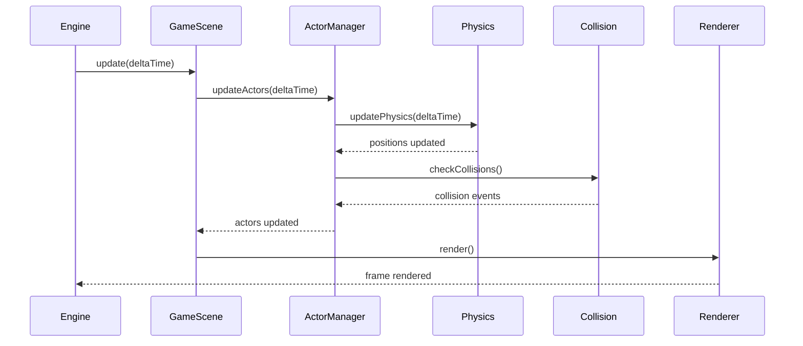

# Propulsion Game - Architecture Documentation

This document provides comprehensive architectural diagrams and documentation for the Propulsion web game, built with TypeScript and Excalibur.js.

## Architecture Overview

The Propulsion game follows a modular architecture with clear separation of concerns between game systems, actors, and user interface components.

### System Architecture Flow

```mermaid
flowchart TD
    %% Entry Points
    main["🏁 main.ts<br/>Application Entry Point"]
    engineBootstrap["⚙️ Engine Bootstrap<br/>Excalibur Engine Initialization"]
    
    %% Scene Management System
    main --> engineBootstrap
    engineBootstrap --> SceneManager["🎬 SceneManager<br/>Scene Orchestration & Transitions"]
    SceneManager --> MenuScene["📋 MenuScene<br/>Menu Interface"]
    SceneManager --> GameScene["🎮 GameScene<br/>Core Game Loop"]
    
    %% Menu System Architecture
    MenuScene --> MenuController["🎛️ MenuController<br/>Menu Logic & Navigation"]
    MenuController --> MainMenu["🏠 MainMenu<br/>Game Start Interface"]
    MenuController --> OptionsMenu["⚙️ OptionsMenu<br/>Settings Management"]
    MenuController --> GameOverMenu["💀 GameOverMenu<br/>End Game Interface"]
    
    %% Core Game System
    GameScene --> GameController["🎮 GameController<br/>Game State Management"]
    GameController --> World["🌍 World<br/>Game World Container"]
    
    %% Actor Management System
    World --> ActorManager["👥 ActorManager<br/>Actor Lifecycle Management"]
    ActorManager --> ActorFactory["🏭 ActorFactory<br/>Dynamic Actor Creation"]
    ActorFactory --> Player["🚀 Player<br/>Player Ship & Logic"]
    ActorFactory --> Enemy["👹 Enemy<br/>Enemy AI & Behavior"]
    ActorFactory --> PowerUp["⭐ PowerUp<br/>Enhancement Items"]
    ActorFactory --> Projectile["💥 Projectile<br/>Weapon Systems"]
    ActorFactory --> Asteroid["🪨 Asteroid<br/>Environmental Hazards"]
    
    %% Physics & Movement System
    World --> PhysicsEngine["⚛️ PhysicsEngine<br/>Physics Simulation"]
    PhysicsEngine --> Forces["💨 Forces<br/>Force Application"]
    PhysicsEngine --> Gravity["🌌 Gravity<br/>Gravitational Physics"]
    PhysicsEngine --> Hyperspace["🌀 Hyperspace<br/>Spatial Teleportation"]
    PhysicsEngine --> Movement["🎯 Movement<br/>Position & Velocity"]
    
    %% Collision Detection System
    GameController --> CollisionDetection["💥 CollisionDetection<br/>Collision Processing"]
    CollisionDetection --> PlayerCollision["🚀💥 PlayerCollision<br/>Player Impact Events"]
    CollisionDetection --> EnemyCollision["👹💥 EnemyCollision<br/>Enemy Impact Events"]
    CollisionDetection --> ProjectileCollision["💥💥 ProjectileCollision<br/>Projectile Impact Events"]
    
    %% Event System
    GameController --> EventManager["📡 EventManager<br/>Event Coordination"]
    EventManager --> GameEvents["⚡ GameEvents<br/>Game Event Types"]
    EventManager --> UserInput["🎮 UserInput<br/>Input Event Processing"]
    
    %% User Interface System
    GameScene --> HUD["📊 HUD<br/>Heads-Up Display"]
    HUD --> VisualEffects["✨ VisualEffects<br/>Visual Feedback Systems"]
    HUD --> TractorBeamDisplay["🔗 TractorBeamDisplay<br/>Tractor Beam Visualization"]
    HUD --> ScoreDisplay["🏆 ScoreDisplay<br/>Score & Statistics"]
    
    %% Level System
    World --> LevelManager["🗺️ LevelManager<br/>Level Management System"]
    LevelManager --> LevelLoader["📂 LevelLoader<br/>Level Data Loading"]
    LevelManager --> LevelProgress["📈 LevelProgress<br/>Progress Tracking"]
    LevelLoader --> WorldBounds["🗺️ WorldBounds<br/>World Boundary Definition"]
    LevelLoader --> WorldState["💾 WorldState<br/>World State Management"]
```

## Class Architecture

### Actor Hierarchy

## Physics System Architecture

### Physics Components

## Game State Management

### State Flow

## Data Flow Architecture

### Game Loop Data Flow

## Key Design Patterns

### Factory Pattern
- **ActorFactory**: Centralizes creation of all game actors
- **Benefit**: Consistent initialization and dependency injection

### Observer Pattern
- **Event System**: Decoupled communication between game systems
- **Collision Events**: Actors respond to collision events without tight coupling

### Component Pattern
- **Physics Components**: Modular physics behavior
- **Graphics Components**: Separates rendering from game logic

### State Pattern
- **Game States**: Clean transitions between menu, gameplay, and game over states
- **Actor States**: Ship behavior changes based on current state (normal, thrusting, hyperspace)

## Performance Considerations

### Optimization Strategies
1. **Object Pooling**: Reuse bullet and particle objects
2. **Spatial Partitioning**: Efficient collision detection
3. **Lazy Loading**: Load assets as needed
4. **Frame Rate Management**: Consistent 60 FPS targeting

### Memory Management
- Proper cleanup of event listeners
- Disposal of graphics resources
- Garbage collection friendly patterns

## Architecture Benefits

### Modularity
- Clear separation between game systems
- Easy to add new actor types
- Testable components

### Scalability
- Factory pattern supports new object types
- Event system handles complex interactions
- Physics system can be extended

### Maintainability
- TypeScript provides type safety
- Clear class hierarchies
- Consistent naming conventions

---

**Architecture Documentation**  
**Project**: Propulsion Web Game  
**Technology Stack**: TypeScript, Excalibur.js, Vite  
**Last Updated**: June 2025
