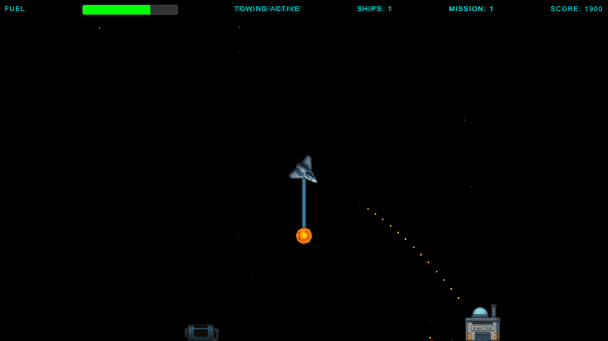
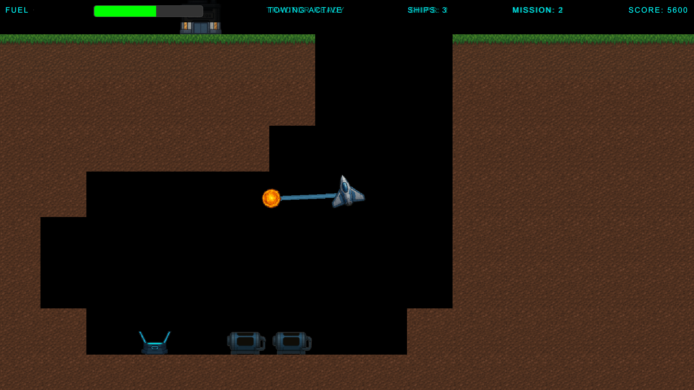
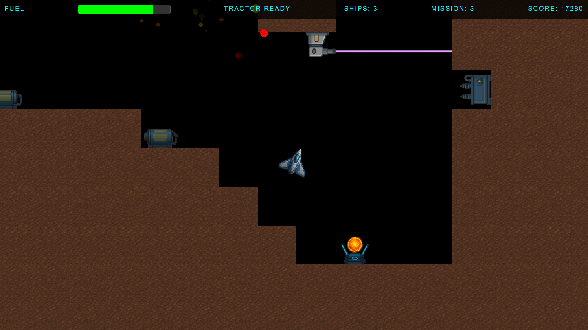

# Propulsion

A modern web-based remake of a classic space physics game, featuring gravity-based gameplay, tractor beam mechanics, and challenging cargo collection missions.

## Overview

Propulsion is a 2D space game where players navigate through gravitational caves using experimental tractor beam technology to collect valuable cargo pods before they're lost to hyperspace rifts. The game combines precise physics simulation with strategic gameplay elements.





## Features

- **Physics-Based Gameplay**: Realistic gravity simulation and momentum-based movement.
- **Tractor Beam Mechanics**: Advanced beam technology for cargo manipulation.
- **Multiple Levels**: Progressive difficulty with unique gravitational challenges.
- **Retro-style Sci-Fi Atmosphere**: Immersive space setting with retro graphics and sound.
- **Web-Based**: Runs in any modern web browser.
- **Legacy Heritage**: Built upon classic game concepts with modern implementation.

## Game Controls

- **Z and X** - Rotate your ship.
- **Shift** - Thrust your ship.
- **Spacebar** - Activate tractor beam.
- **ESC** - Pause game / Return to menu.

## Project Structure

- `propulsionWeb/` - Modern TypeScript/JavaScript web implementation.
- `legacyCode/` - Partial remake in C++ and assembler from 1997.
- `docs/` - Interactive design documentation, accessible via `readme.sh`.
- `src/game/` - Core game physics, logic, actors, and game UI.
- `src/menu/` - Menu system and UI.
- `src/styles/` - SCSS stylesheets.
- `public/` - Static assets (images, sounds, levels).
- `external/` - Clone of the Excalibur-tiled game engine.
- `mapeditor-tiled/` - Copy of the open-source Excalibur-compliant map editor.

### Technologies Used

- **Cline** - Client agent.
- **Copilot** - Claude Sonnet 4.
- **ChatGPT** - Image and sprite generation.
- **TypeScript** - Type-safe JavaScript development.
- **Excalibur.js** - 2D game engine with physics.
- **Vite** - Modern build tool and dev server.
- **Web Audio API** - Spatial sound effects.
- **Canvas/WebGL** - Hardware-accelerated graphics.

## Development

### Prerequisites

- Node.js (version 16 or higher).
- npm or yarn package manager.
- Git (for cloning dependencies).

### Installation

1. Clone the repository:
   ```bash
   git clone https://github.com/vlietland/propulsion.git
   cd propulsion
   ```

2. Run the setup script to install all dependencies:
   ```bash
   ./setup.sh
   ```
   
   This script will:
   - Install Node.js and npm if not already installed
   - Clone the required excalibur-tiled dependency
   - Install all project dependencies

3. Start the development server:
   ```bash
   ./run.sh
   ```
   
   Or start with automatic browser opening:
   ```bash
   ./run.sh browser
   ```

4. Open your browser to `http://localhost:5173` (if not opened automatically).


### Building for Production

```bash
npm run build
```

Or use the convenience script:
```bash
./publish.sh
```

### Utility Scripts

For convenience, the project includes several utility scripts:

- `./setup.sh` - Complete project setup
- `./run.sh` - Start development server
- `./run.sh browser` - Start development server and open browser
- `./run.sh preview` - Start preview server for production build
- `./publish.sh` - Build and publish to GitHub Pages

---

## License

**GNU GENERAL PUBLIC LICENSE Version 3**

Copyright (C) 2025 Propulsion Game Project

This program is free software: you can redistribute it and/or modify
it under the terms of the GNU General Public License as published by
the Free Software Foundation, either version 3 of the License, or
(at your option) any later version.

This program is distributed in the hope that it will be useful,
but WITHOUT ANY WARRANTY; without even the implied warranty of
MERCHANTABILITY or FITNESS FOR A PARTICULAR PURPOSE. See the
GNU General Public License for more details.

You should have received a copy of the GNU General Public License
along with this program. If not, see <https://www.gnu.org/licenses/>.

### GPL v3 License Terms

This project is licensed under the **GNU General Public License version 3 (GPL v3)**, which is a strong copyleft license. This means:

#### Your Rights:
- **Use** - You can use this software for any purpose.
- **Study** - You can study how the program works and access the source code.
- **Share** - You can redistribute copies of the software.
- **Modify** - You can modify the software and distribute your modifications.

#### Your Obligations:
- **Share Source** - If you distribute this software (modified or unmodified), you must provide the source code.
- **Same License** - Any derivative works must also be licensed under GPL v3.
- **Attribution** - You must preserve copyright notices and license information.
- **No Additional Restrictions** - You cannot impose additional restrictions beyond those in the GPL.

#### Important Notes:
- This license applies to the **entire work** - if you incorporate GPL v3 code into your project, your entire project must be GPL v3 compatible.
- **Commercial use is allowed**, but the source code must still be provided under GPL v3 terms.
- **Patents** - Contributors grant patent rights for their contributions.
- **No Warranty** - The software is provided "as is" without warranty.

#### For Businesses and Proprietary Projects:
If you need to use this code in a proprietary project without GPL obligations, you must either:
1. Not use this GPL v3 licensed code at all, or
2. Contact the copyright holders for alternative licensing arrangements.

#### Third-Party Components:
Some dependencies may have different licenses. Check individual component licenses in `package.json` and their respective documentation.

For the complete license text, see: https://www.gnu.org/licenses/gpl-3.0.html

---

**Contact**: For licensing questions or alternative licensing arrangements, please open an issue in the project repository.